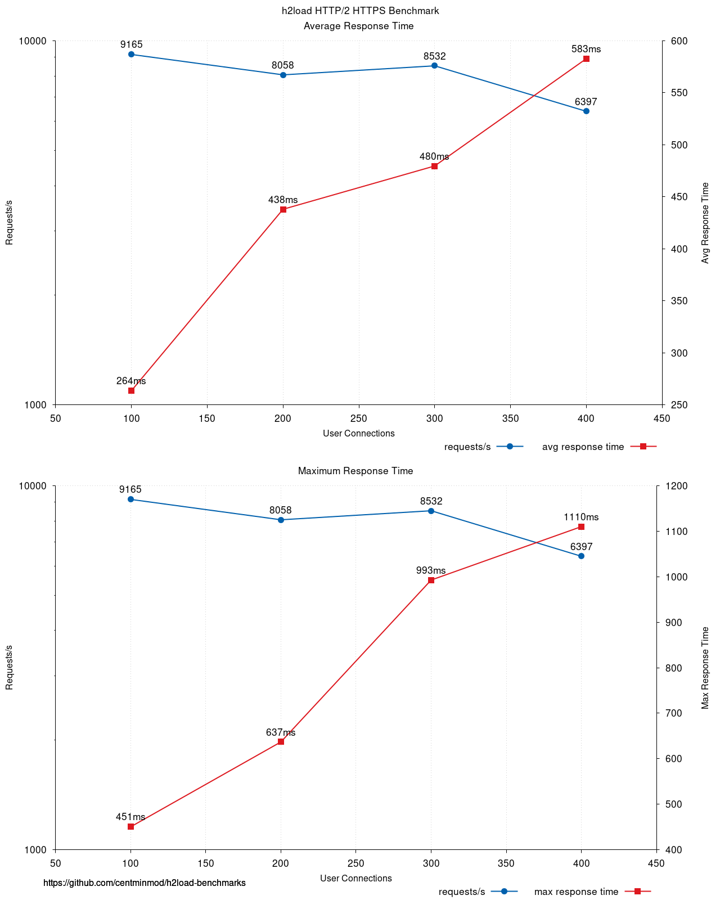
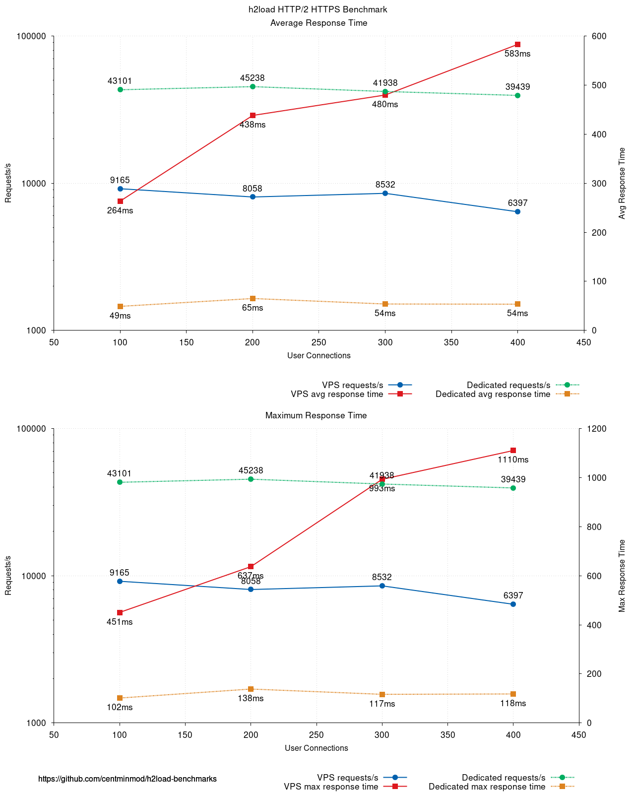

      

# Requirements

```
yum -y install nghttp2 gnuplot jq
```

psrecord and matplotlib for logging and chart plotting for local Nginx resource usage

```
pip install psrecord
pip install matplotlib
```

or

```
pip3 install psrecord
pip3 install matplotlib
```

# Usage

Includes a [Batch Mode](#batch-mode) with charting support. Example charting for:

* [VPS benchmarks](#batch-mode-vps) 
* [Dedicated server benchmarks](#batch-mode-dedicated-server).
* [Comparison Charts](#comparison-charts)
* [psrecord](#psrecord)

```
./h2load-bench.sh 
Usage: ./h2load-bench.sh [-t threads] [-c connections] [-n requests] [-D duration] [-w warm-up] [-u uri1,uri2,...] [-b batch] [-C compress] [-f format]

Options:
  -t, --threads       Number of threads
  -c, --connections   Number of connections
  -n, --requests      Number of requests
  -D, --duration      Duration of the benchmark
  -w, --warm-up       Warm-up time before the benchmark
  -u, --uri           Comma-separated list of URIs to request
  -b, --batch         Enable batch mode
  -C, --compress      Compression option (gzip, br, zstd, none)
  -f, --format        Output format (json or markdown)
  -h, --help          Display this help message
```

## Multiple Domain/URL Tests

Updated 9/9/24 - allow for script to test multiple domain/urls/servers via comma separated list of `-u` URI i.e. `https://domain.com:443,https://domain.com:8443` which will test:

* `https://domain.com:443` web server on port `443`
* `https://domain.com:8443` web server on port `8443`

```
t=4; c=100; n=1000;

bash h2load-bench.sh -t${t} -c${c} -n${n} -u https://domain.com:443,https://domain.com:8443
Running benchmark for https://domain.com:443
Running benchmark for https://domain.com:8443
[{
  "time": "44.1955",
  "time_min": "40.3000",
  "time_max": "52.4800",
  "time_95pc": "46.0400",
  "req_per_sec": "22725.1627",
  "req_per_sec_min": "19055.2400",
  "req_per_sec_max": "24814.5100",
  "req_per_sec_95pc": "24330.9000",
  "mbs": "49.1936MB/s",
  "mbs_min": "41.2500MB/s",
  "mbs_max": "53.7200MB/s",
  "mbs_95pc": "52.6700MB/s",
  "req_min": "0.0027s",
  "req_min_min": "0.0005s",
  "req_min_max": "0.0040s",
  "req_min_95pc": "0.0040s",
  "req_max": "0.0261s",
  "req_max_min": "0.0204s",
  "req_max_max": "0.0342s",
  "req_max_95pc": "0.0316s",
  "req_mean": "0.0125s",
  "req_mean_min": "0.0114s",
  "req_mean_max": "0.0140s",
  "req_mean_95pc": "0.0140s",
  "req_sd": "0.0053s",
  "req_sd_min": "0.0039s",
  "req_sd_max": "0.0074s",
  "req_sd_95pc": "0.0061s",
  "req_sd_pct": "66.1000s",
  "req_sd_pct_min": "59.9000s",
  "req_sd_pct_max": "71.8000s",
  "req_sd_pct_95pc": "71.6000s",
  "conn_min": "0.0039s",
  "conn_min_min": "0.0032s",
  "conn_min_max": "0.0051s",
  "conn_min_95pc": "0.0049s",
  "conn_max": "0.0201s",
  "conn_max_min": "0.0170s",
  "conn_max_max": "0.0247s",
  "conn_max_95pc": "0.0233s",
  "conn_mean": "0.0113s",
  "conn_mean_min": "0.0099s",
  "conn_mean_max": "0.0142s",
  "conn_mean_95pc": "0.0125s",
  "conn_sd": "0.0045s",
  "conn_sd_min": "0.0037s",
  "conn_sd_max": "0.0058s",
  "conn_sd_95pc": "0.0051s",
  "conn_sd_pct": "59.8182s",
  "conn_sd_pct_min": "56.0000s",
  "conn_sd_pct_max": "64.0000s",
  "conn_sd_pct_95pc": "63.0000s",
  "first_byte_min": "0.0143s",
  "first_byte_min_min": "0.0121s",
  "first_byte_min_max": "0.0160s",
  "first_byte_min_95pc": "0.0158s",
  "first_byte_max": "0.0420s",
  "first_byte_max_min": "0.0379s",
  "first_byte_max_max": "0.0506s",
  "first_byte_max_95pc": "0.0434s",
  "first_byte_mean": "0.0233s",
  "first_byte_mean_min": "0.0215s",
  "first_byte_mean_max": "0.0253s",
  "first_byte_mean_95pc": "0.0241s",
  "first_byte_sd": "0.0070s",
  "first_byte_sd_min": "0.0060s",
  "first_byte_sd_max": "0.0089s",
  "first_byte_sd_95pc": "0.0078s",
  "first_byte_sd_pct": "69.1818s",
  "first_byte_sd_pct_min": "60.0000s",
  "first_byte_sd_pct_max": "80.0000s",
  "first_byte_sd_pct_95pc": "73.0000s",
  "req_s_min": "230.0200",
  "req_s_min_min": "191.7700",
  "req_s_min_max": "254.2100",
  "req_s_min_95pc": "246.7300",
  "req_s_max": "697.4691",
  "req_s_max_min": "620.6500",
  "req_s_max_max": "818.3000",
  "req_s_max_95pc": "758.2800",
  "req_s_mean": "448.8827",
  "req_s_mean_min": "404.8800",
  "req_s_mean_max": "489.1200",
  "req_s_mean_95pc": "481.1800",
  "req_s_sd": "127.6164",
  "req_s_sd_min": "101.3500",
  "req_s_sd_max": "150.5400",
  "req_s_sd_95pc": "147.7600",
  "req_s_sd_pct": "59.2727",
  "req_s_sd_pct_min": "54.0000",
  "req_s_sd_pct_max": "68.0000",
  "req_s_sd_pct_95pc": "62.0000",
  "total_req": "1000.0000",
  "started_req": "1000.0000",
  "done_req": "1000.0000",
  "succeeded_req": "1000.0000",
  "failed_req": "0.0000",
  "errored_req": "0.0000",
  "timeout_req": "0.0000",
  "status_2xx": "1000.0000",
  "status_3xx": "0.0000",
  "status_4xx": "0.0000",
  "status_5xx": "0.0000",
  "total_traffic": "2.1600KB",
  "header_traffic": "202.1500KB",
  "data_traffic": "1.9500KB",
  "threads": "4.0000",
  "connections": "100.0000",
  "requests": "1000.0000",
  "cipher": "TLS_AES_256_GCM_SHA384",
  "tempkey": "X25519",
  "protocol": "h2",
  "duration": "null",
  "warm_up_time": "null",
  "uri": "https://domain.com:443"
},{
  "time": "38.9082",
  "time_min": "26.3800",
  "time_max": "63.8100",
  "time_95pc": "47.0100",
  "req_per_sec": "27476.1236",
  "req_per_sec_min": "15672.7500",
  "req_per_sec_max": "37914.6900",
  "req_per_sec_95pc": "35728.3200",
  "mbs": "56.2055MB/s",
  "mbs_min": "32.0600MB/s",
  "mbs_max": "77.5600MB/s",
  "mbs_95pc": "73.0900MB/s",
  "req_min": "0.0027s",
  "req_min_min": "0.0009s",
  "req_min_max": "0.0070s",
  "req_min_95pc": "0.0031s",
  "req_max": "0.0265s",
  "req_max_min": "0.0145s",
  "req_max_max": "0.0487s",
  "req_max_95pc": "0.0387s",
  "req_mean": "0.0130s",
  "req_mean_min": "0.0082s",
  "req_mean_max": "0.0218s",
  "req_mean_95pc": "0.0172s",
  "req_sd": "0.0056s",
  "req_sd_min": "0.0026s",
  "req_sd_max": "0.0105s",
  "req_sd_95pc": "0.0082s",
  "req_sd_pct": "64.0545s",
  "req_sd_pct_min": "58.6000s",
  "req_sd_pct_max": "70.3000s",
  "req_sd_pct_95pc": "70.0000s",
  "conn_min": "0.0055s",
  "conn_min_min": "0.0017s",
  "conn_min_max": "0.0068s",
  "conn_min_95pc": "0.0064s",
  "conn_max": "0.0255s",
  "conn_max_min": "0.0225s",
  "conn_max_max": "0.0305s",
  "conn_max_95pc": "0.0301s",
  "conn_mean": "0.0146s",
  "conn_mean_min": "0.0123s",
  "conn_mean_max": "0.0162s",
  "conn_mean_95pc": "0.0162s",
  "conn_sd": "0.0056s",
  "conn_sd_min": "0.0040s",
  "conn_sd_max": "0.0077s",
  "conn_sd_95pc": "0.0074s",
  "conn_sd_pct": "60.2727s",
  "conn_sd_pct_min": "56.0000s",
  "conn_sd_pct_max": "65.0000s",
  "conn_sd_pct_95pc": "63.0000s",
  "first_byte_min": "0.0188s",
  "first_byte_min_min": "0.0091s",
  "first_byte_min_max": "0.0251s",
  "first_byte_min_95pc": "0.0228s",
  "first_byte_max": "0.0380s",
  "first_byte_max_min": "0.0260s",
  "first_byte_max_max": "0.0630s",
  "first_byte_max_95pc": "0.0460s",
  "first_byte_mean": "0.0266s",
  "first_byte_mean_min": "0.0201s",
  "first_byte_mean_max": "0.0349s",
  "first_byte_mean_95pc": "0.0296s",
  "first_byte_sd": "0.0049s",
  "first_byte_sd_min": "0.0016s",
  "first_byte_sd_max": "0.0127s",
  "first_byte_sd_95pc": "0.0076s",
  "first_byte_sd_pct": "68.3636s",
  "first_byte_sd_pct_min": "57.0000s",
  "first_byte_sd_pct_max": "83.0000s",
  "first_byte_sd_pct_95pc": "82.0000s",
  "req_s_min": "277.1827",
  "req_s_min_min": "158.0700",
  "req_s_min_max": "383.3700",
  "req_s_min_95pc": "360.3000",
  "req_s_max": "563.6845",
  "req_s_max_min": "397.2900",
  "req_s_max_max": "976.2400",
  "req_s_max_95pc": "799.4300",
  "req_s_mean": "365.4445",
  "req_s_mean_min": "280.5500",
  "req_s_mean_max": "477.5800",
  "req_s_mean_95pc": "418.3000",
  "req_s_sd": "68.3255",
  "req_s_sd_min": "29.1500",
  "req_s_sd_max": "118.6600",
  "req_s_sd_95pc": "108.8900",
  "req_s_sd_pct": "67.5455",
  "req_s_sd_pct_min": "51.0000",
  "req_s_sd_pct_max": "94.0000",
  "req_s_sd_pct_95pc": "87.0000",
  "total_req": "1000.0000",
  "started_req": "1000.0000",
  "done_req": "1000.0000",
  "succeeded_req": "1000.0000",
  "failed_req": "0.0000",
  "errored_req": "0.0000",
  "timeout_req": "0.0000",
  "status_2xx": "1000.0000",
  "status_3xx": "0.0000",
  "status_4xx": "0.0000",
  "status_5xx": "0.0000",
  "total_traffic": "2.0500KB",
  "header_traffic": "34.0800KB",
  "data_traffic": "1.9900KB",
  "threads": "4.0000",
  "connections": "100.0000",
  "requests": "1000.0000",
  "cipher": "TLS_AES_128_GCM_SHA256",
  "tempkey": "X25519",
  "protocol": "h2",
  "duration": "null",
  "warm_up_time": "null",
  "uri": "https://domain.com:8443"
}]
```

## JSON parsed HTTP/3 Test

When h2load binary is built with HTTP/3 QUIC support, UDP sent/received size metrics are provided too and `protocol` reports `h3` tested.


```
./h2load-bench.sh -t1 -c10 -n100 -u https://domain.com
```

or pretty JSON format only:

```
./h2load-bench.sh -t1 -c10 -n100 -u https://domain.com | grep -oP '{.*}' | jq -r
{
  "time": "10.12ms",
  "req_per_sec": "9877.52",
  "mbs": "21.17MB/s",
  "total_req": "100",
  "started_req": "100",
  "done_req": "100",
  "succeeded_req": "100",
  "failed_req": "0",
  "errored_req": "0",
  "timeout_req": "0",
  "status_2xx": "100",
  "status_3xx": "0",
  "status_4xx": "0",
  "status_5xx": "0",
  "total_traffic": "219.42KB",
  "header_traffic": "18.26KB",
  "data_traffic": "200.49KB",
  "req_min": "2.35",
  "req_max": "4.78",
  "req_mean": "3.91",
  "req_sd": "807us",
  "req_sd_pct": "60.00%",
  "conn_min": "2.65",
  "conn_max": "5.50",
  "conn_mean": "4.04",
  "conn_sd": "955us",
  "conn_sd_pct": "60.00%",
  "first_byte_min": "6.62",
  "first_byte_max": "9.14",
  "first_byte_mean": "7.75",
  "first_byte_sd": "930us",
  "first_byte_sd_pct": "70.00%",
  "req_s_min": "1050.69",
  "req_s_max": "1374.58",
  "req_s_mean": "1216.51",
  "req_s_sd": "113.10",
  "req_s_sd_pct": "113.10",
  "cipher": "TLS_AES_256_GCM_SHA384",
  "tempkey": "X25519",
  "protocol": "h3",
  "threads": "1",
  "connections": "10",
  "duration": "null",
  "warm_up_time": "null",
  "requests": "100",
  "udp_sent": "52",
  "udp_received": "251"
}
```

## JSON parsed HTTP/2 Test

```
./h2load-bench.sh -t 1 -c 10 -n 100 -u https://domain.com
```

or pretty JSON format only:

```
./h2load-bench.sh -t 1 -c 10 -n 100 -u https://domain.com | grep -oP '{.*}' | jq
{
  "time": "38.44ms",
  "req_per_sec": "2601.59",
  "mbs": "5.05MB/s",
  "total_req": "100",
  "started_req": "100",
  "done_req": "100",
  "succeeded_req": "100",
  "failed_req": "0",
  "errored_req": "0",
  "timeout_req": "0",
  "status_2xx": "100",
  "status_3xx": "0",
  "status_4xx": "0",
  "status_5xx": "0",
  "total_traffic": "198.92KB",
  "header_traffic": "20.21KB",
  "data_traffic": "176.46KB",
  "req_min": "1.70ms",
  "req_max": "13.72ms",
  "req_mean": "8.74ms",
  "req_sd": "2.81ms",
  "req_sd_pct": "69.00%",
  "conn_min": "1.55ms",
  "conn_max": "12.47ms",
  "conn_mean": "7.50ms",
  "conn_sd": "3.50ms",
  "conn_sd_pct": "60.00%",
  "first_byte_min": "25.43ms",
  "first_byte_max": "35.52ms",
  "first_byte_mean": "30.03ms",
  "first_byte_sd": "4.73ms",
  "first_byte_sd_pct": "60.00%",
  "req_s_min": "280.64",
  "req_s_max": "390.65",
  "req_s_mean": "329.72",
  "req_s_sd": "51.35",
  "req_s_sd_pct": "51.35",
  "cipher": "TLS_AES_256_GCM_SHA384",
  "tempkey": "X25519",
  "protocol": "h2",
  "threads": "1",
  "connections": "10",
  "duration": "null",
  "warm_up_time": "null",
  "requests": "100"
}
```

JSON parsed reduced array fields

```
cat h2load-logs/h2load-stats-20230514034938.json | jq -r '{
  "req_per_sec": .req_per_sec,
  "success_percentage": (100 * (.succeeded_req | tonumber) / (.total_req | tonumber)),
  "req_min": .req_min,
  "req_mean": .req_mean,
  "req_max": .req_max,
  "conn_min": .conn_min,
  "conn_mean": .conn_mean,
  "conn_max": .conn_max,
  "first_byte_min": .first_byte_min,
  "first_byte_mean": .first_byte_mean,
  "first_byte_max": .first_byte_max,
  "req_s_min": .req_s_min,
  "req_s_mean": .req_s_mean,
  "req_s_max": .req_s_max,
  "threads": .threads,
  "connections": .connections,
  "duration": .duration,
  "warm_up_time": .warm_up_time,
  "requests": .requests
}'

{
  "req_per_sec": "2601.59",
  "success_percentage": 100,
  "req_min": "1.70ms",
  "req_mean": "8.74ms",
  "req_max": "13.72ms",
  "conn_min": "1.55ms",
  "conn_mean": "7.50ms",
  "conn_max": "12.47ms",
  "first_byte_min": "25.43ms",
  "first_byte_mean": "30.03ms",
  "first_byte_max": "35.52ms",
  "req_s_min": "280.64",
  "req_s_mean": "329.72",
  "req_s_max": "390.65",
  "threads": "1",
  "connections": "10",
  "duration": "null",
  "warm_up_time": "null",
  "requests": "100"
}
```

Raw log

```
cat h2load-logs/h2load-raw-20230514034938.log

starting benchmark...
spawning thread #0: 10 total client(s). 100 total requests
TLS Protocol: TLSv1.3
Cipher: TLS_AES_256_GCM_SHA384
Server Temp Key: X25519 253 bits
Application protocol: h2
progress: 10% done
progress: 20% done
progress: 30% done
progress: 40% done
progress: 50% done
progress: 60% done
progress: 70% done
progress: 80% done
progress: 90% done
progress: 100% done

finished in 38.44ms, 2601.59 req/s, 5.05MB/s
requests: 100 total, 100 started, 100 done, 100 succeeded, 0 failed, 0 errored, 0 timeout
status codes: 100 2xx, 0 3xx, 0 4xx, 0 5xx
traffic: 198.92KB (203690) total, 20.21KB (20700) headers (space savings 26.33%), 176.46KB (180700) data
                     min         max         mean         sd        +/- sd
time for request:     1.70ms     13.72ms      8.74ms      2.81ms    69.00%
time for connect:     1.55ms     12.47ms      7.50ms      3.50ms    60.00%
time to 1st byte:    25.43ms     35.52ms     30.03ms      4.73ms    60.00%
req/s           :     280.64      390.65      329.72       51.35    70.00%
```

# Batch Mode

`-b` batch mode will take the connections value `-c 400` and divide it into 4 quarters for 4 `h2load` runs incrementing the by each quarter so `-c 100`, `-c 200`, `-c 300`, `-c 400`.

## Batch Mode VPS

Run on 2 CPU KVM VPS with 2GB memory, 50GB NVMe disk.

```
lscpu
Architecture:        x86_64
CPU op-mode(s):      32-bit, 64-bit
Byte Order:          Little Endian
CPU(s):              2
On-line CPU(s) list: 0,1
Thread(s) per core:  1
Core(s) per socket:  1
Socket(s):           2
NUMA node(s):        1
Vendor ID:           GenuineIntel
BIOS Vendor ID:      Red Hat
CPU family:          6
Model:               158
Model name:          Intel(R) Xeon(R) E-2286G CPU @ 4.00GHz
BIOS Model name:     RHEL 7.6.0 PC (i440FX + PIIX, 1996)
Stepping:            10
CPU MHz:             4008.000
BogoMIPS:            8016.00
Hypervisor vendor:   KVM
Virtualization type: full
L1d cache:           32K
L1i cache:           32K
L2 cache:            4096K
L3 cache:            16384K
NUMA node0 CPU(s):   0,1
Flags:               fpu vme de pse tsc msr pae mce cx8 apic sep mtrr pge mca cmov pat pse36 clflush mmx fxsr sse sse2 ss syscall nx pdpe1gb rdtscp lm constant_tsc arch_perfmon rep_good nopl xtopology cpuid tsc_known_freq pni pclmulqdq ssse3 fma cx16 pcid sse4_1 sse4_2 x2apic movbe popcnt tsc_deadline_timer aes xsave avx f16c rdrand hypervisor lahf_lm abm 3dnowprefetch invpcid_single pti ssbd ibrs ibpb stibp fsgsbase tsc_adjust bmi1 hle avx2 smep bmi2 erms invpcid rtm mpx rdseed adx smap clflushopt xsaveopt xsavec xgetbv1 arat md_clear
```

Run `h2load-bench.sh` wrapper script with h2load with 1 thread `-t 1` to load 1/2 the CPU cores of the VPS.

```
./h2load-bench.sh -t 1 -c 400 -n 10000 -b -u https://domain.com
```

or JSON pretty format only:

```
./h2load-bench.sh -t 1 -c 400 -n 10000 -b -u https://domain.com | grep -oP '{.*}' | jq
{
  "time": "1.09s",
  "req_per_sec": "9165.04",
  "mbs": "17.76MB/s",
  "total_req": "10000",
  "started_req": "10000",
  "done_req": "10000",
  "succeeded_req": "10000",
  "failed_req": "0",
  "errored_req": "0",
  "timeout_req": "0",
  "status_2xx": "10000",
  "status_3xx": "0",
  "status_4xx": "0",
  "status_5xx": "0",
  "total_traffic": "19.37MB",
  "header_traffic": "1.96MB",
  "data_traffic": "17.23MB",
  "req_min": "23.13",
  "req_max": "450.53",
  "req_mean": "263.59",
  "req_sd": "89.85ms",
  "req_sd_pct": "66.37%",
  "conn_min": "2.44",
  "conn_max": "350.00",
  "conn_mean": "170.02",
  "conn_sd": "115.06ms",
  "conn_sd_pct": "62.00%",
  "first_byte_min": "225.98",
  "first_byte_max": "645.23",
  "first_byte_mean": "470.97",
  "first_byte_sd": "147.48ms",
  "first_byte_sd_pct": "52.00%",
  "req_s_min": "91.85",
  "req_s_max": "95.19",
  "req_s_mean": "92.75",
  "req_s_sd": "1.06",
  "req_s_sd_pct": "1.06",
  "cipher": "TLS_AES_256_GCM_SHA384",
  "tempkey": "X25519",
  "protocol": "h2",
  "threads": "1",
  "connections": "100",
  "duration": "null",
  "warm_up_time": "null",
  "requests": "10000"
}
{
  "time": "1.24s",
  "req_per_sec": "8057.98",
  "mbs": "15.62MB/s",
  "total_req": "10000",
  "started_req": "10000",
  "done_req": "10000",
  "succeeded_req": "10000",
  "failed_req": "0",
  "errored_req": "0",
  "timeout_req": "0",
  "status_2xx": "10000",
  "status_3xx": "0",
  "status_4xx": "0",
  "status_5xx": "0",
  "total_traffic": "19.38MB",
  "header_traffic": "1.96MB",
  "data_traffic": "17.23MB",
  "req_min": "6.50",
  "req_max": "636.99",
  "req_mean": "438.00",
  "req_sd": "172.99ms",
  "req_sd_pct": "61.55%",
  "conn_min": "5.62",
  "conn_max": "1080",
  "conn_mean": "293.98",
  "conn_sd": "254.28ms",
  "conn_sd_pct": "60.00%",
  "first_byte_min": "686.81",
  "first_byte_max": "1180",
  "first_byte_mean": "906.66",
  "first_byte_sd": "121.46ms",
  "first_byte_sd_pct": "71.50%",
  "req_s_min": "40.52",
  "req_s_max": "45.34",
  "req_s_mean": "43.31",
  "req_s_sd": "1.07",
  "req_s_sd_pct": "1.07",
  "cipher": "TLS_AES_256_GCM_SHA384",
  "tempkey": "X25519",
  "protocol": "h2",
  "threads": "1",
  "connections": "200",
  "duration": "null",
  "warm_up_time": "null",
  "requests": "10000"
}
{
  "time": "1.17s",
  "req_per_sec": "8532.37",
  "mbs": "16.54MB/s",
  "total_req": "10000",
  "started_req": "10000",
  "done_req": "10000",
  "succeeded_req": "10000",
  "failed_req": "0",
  "errored_req": "0",
  "timeout_req": "0",
  "status_2xx": "10000",
  "status_3xx": "0",
  "status_4xx": "0",
  "status_5xx": "0",
  "total_traffic": "19.38MB",
  "header_traffic": "1.96MB",
  "data_traffic": "17.23MB",
  "req_min": "11.71",
  "req_max": "992.65",
  "req_mean": "479.59",
  "req_sd": "225.89ms",
  "req_sd_pct": "67.71%",
  "conn_min": "13.03",
  "conn_max": "993.82",
  "conn_mean": "345.54",
  "conn_sd": "352.23ms",
  "conn_sd_pct": "78.00%",
  "first_byte_min": "342.87",
  "first_byte_max": "1140",
  "first_byte_mean": "830.06",
  "first_byte_sd": "285.88ms",
  "first_byte_sd_pct": "74.67%",
  "req_s_min": "28.47",
  "req_s_max": "32.22",
  "req_s_mean": "29.97",
  "req_s_sd": "1.21",
  "req_s_sd_pct": "1.21",
  "cipher": "TLS_AES_256_GCM_SHA384",
  "tempkey": "X25519",
  "protocol": "h2",
  "threads": "1",
  "connections": "300",
  "duration": "null",
  "warm_up_time": "null",
  "requests": "10000"
}
{
  "time": "1.56s",
  "req_per_sec": "6397.04",
  "mbs": "12.40MB/s",
  "total_req": "10000",
  "started_req": "10000",
  "done_req": "10000",
  "succeeded_req": "10000",
  "failed_req": "0",
  "errored_req": "0",
  "timeout_req": "0",
  "status_2xx": "10000",
  "status_3xx": "0",
  "status_4xx": "0",
  "status_5xx": "0",
  "total_traffic": "19.39MB",
  "header_traffic": "1.96MB",
  "data_traffic": "17.23MB",
  "req_min": "73.40",
  "req_max": "1110",
  "req_mean": "582.73",
  "req_sd": "306.33ms",
  "req_sd_pct": "54.50%",
  "conn_min": "15.32",
  "conn_max": "1400",
  "conn_mean": "623.92",
  "conn_sd": "405.47ms",
  "conn_sd_pct": "58.50%",
  "first_byte_min": "266.48",
  "first_byte_max": "1560",
  "first_byte_mean": "1300",
  "first_byte_sd": "413.59ms",
  "first_byte_sd_pct": "86.00%",
  "req_s_min": "16.04",
  "req_s_max": "93.74",
  "req_s_mean": "27.32",
  "req_s_sd": "25.37",
  "req_s_sd_pct": "25.37",
  "cipher": "TLS_AES_256_GCM_SHA384",
  "tempkey": "X25519",
  "protocol": "h2",
  "threads": "1",
  "connections": "400",
  "duration": "null",
  "warm_up_time": "null",
  "requests": "10000"
}
```

Then run `h2load-plot.gnuplot` to generate chart `output.png`, `output-avg.png` and `output-max.png`

```
./h2load-plot.gnuplot
```

`output.png`



`output-avg.png`


`output-max.png`


## Batch Mode Dedicated Server

Run on dedicated server Intel Xeon E-2276G 6 cores / 12 threads with 32GB memory, 2x960GB NVMe raid 1.

```
lscpu
Architecture:        x86_64
CPU op-mode(s):      32-bit, 64-bit
Byte Order:          Little Endian
CPU(s):              12
On-line CPU(s) list: 0-11
Thread(s) per core:  2
Core(s) per socket:  6
Socket(s):           1
NUMA node(s):        1
Vendor ID:           GenuineIntel
BIOS Vendor ID:      Intel(R) Corporation
CPU family:          6
Model:               158
Model name:          Intel(R) Xeon(R) E-2276G CPU @ 3.80GHz
BIOS Model name:     Intel(R) Xeon(R) E-2276G CPU @ 3.80GHz
Stepping:            10
CPU MHz:             3800.000
CPU max MHz:         4900.0000
CPU min MHz:         800.0000
BogoMIPS:            7584.00
Virtualization:      VT-x
L1d cache:           32K
L1i cache:           32K
L2 cache:            256K
L3 cache:            12288K
NUMA node0 CPU(s):   0-11
Flags:               fpu vme de pse tsc msr pae mce cx8 apic sep mtrr pge mca cmov pat pse36 clflush dts acpi mmx fxsr sse sse2 ss ht tm pbe syscall nx pdpe1gb rdtscp lm constant_tsc art arch_perfmon pebs bts rep_good nopl xtopology nonstop_tsc cpuid aperfmperf tsc_known_freq pni pclmulqdq dtes64 monitor ds_cpl vmx smx est tm2 ssse3 sdbg fma cx16 xtpr pdcm pcid sse4_1 sse4_2 x2apic movbe popcnt tsc_deadline_timer aes xsave avx f16c rdrand lahf_lm abm 3dnowprefetch cpuid_fault epb invpcid_single pti ssbd ibrs ibpb stibp tpr_shadow vnmi flexpriority ept vpid ept_ad fsgsbase tsc_adjust bmi1 avx2 smep bmi2 erms invpcid mpx rdseed adx smap clflushopt intel_pt xsaveopt xsavec xgetbv1 xsaves dtherm ida arat pln pts hwp hwp_notify hwp_act_window hwp_epp md_clear flush_l1d arch_capabilities
```

Run `h2load-bench.sh` wrapper script with h2load with 3 thread `-t 3` to load only 1/2 the physical CPU cores on dedicated.

```
./h2load-bench.sh -t 3 -c 400 -n 10000 -b -u https://domain.com
```

Or JSON pretty format only:

```
./h2load-bench.sh -t 3 -c 400 -n 10000 -b -u https://domain.com | grep -oP '{.*}' | jq
{
  "time": "232.01ms",
  "req_per_sec": "43100.85",
  "mbs": "93.12MB/s",
  "total_req": "10000",
  "started_req": "10000",
  "done_req": "10000",
  "succeeded_req": "10000",
  "failed_req": "0",
  "errored_req": "0",
  "timeout_req": "0",
  "status_2xx": "10000",
  "status_3xx": "0",
  "status_4xx": "0",
  "status_5xx": "0",
  "total_traffic": "21.61MB",
  "header_traffic": "1.97MB",
  "data_traffic": "19.45MB",
  "req_min": "0.26",
  "req_max": "101.58",
  "req_mean": "49.10",
  "req_sd": "21.76ms",
  "req_sd_pct": "61.35%",
  "conn_min": "3.41",
  "conn_max": "57.55",
  "conn_mean": "13.98",
  "conn_sd": "8.60ms",
  "conn_sd_pct": "86.00%",
  "first_byte_min": "18.64",
  "first_byte_max": "127.35",
  "first_byte_mean": "47.10",
  "first_byte_sd": "22.96ms",
  "first_byte_sd_pct": "63.00%",
  "req_s_min": "424.95",
  "req_s_max": "1345.96",
  "req_s_mean": "563.78",
  "req_s_sd": "225.18",
  "req_s_sd_pct": "225.18",
  "cipher": "TLS_AES_256_GCM_SHA384",
  "tempkey": "X25519",
  "protocol": "h2",
  "threads": "3",
  "connections": "100",
  "duration": "null",
  "warm_up_time": "null",
  "requests": "10000"
}
{
  "time": "221.05ms",
  "req_per_sec": "45238.43",
  "mbs": "97.76MB/s",
  "total_req": "10000",
  "started_req": "10000",
  "done_req": "10000",
  "succeeded_req": "10000",
  "failed_req": "0",
  "errored_req": "0",
  "timeout_req": "0",
  "status_2xx": "10000",
  "status_3xx": "0",
  "status_4xx": "0",
  "status_5xx": "0",
  "total_traffic": "21.61MB",
  "header_traffic": "1.97MB",
  "data_traffic": "19.45MB",
  "req_min": "0.503",
  "req_max": "138.31",
  "req_mean": "65.04",
  "req_sd": "28.23ms",
  "req_sd_pct": "61.28%",
  "conn_min": "3.90",
  "conn_max": "132.27",
  "conn_mean": "26.85",
  "conn_sd": "18.40ms",
  "conn_sd_pct": "92.50%",
  "first_byte_min": "35.87",
  "first_byte_max": "197.16",
  "first_byte_mean": "82.18",
  "first_byte_sd": "37.62ms",
  "first_byte_sd_pct": "63.50%",
  "req_s_min": "226.51",
  "req_s_max": "1043.53",
  "req_s_mean": "319.90",
  "req_s_sd": "92.43",
  "req_s_sd_pct": "92.43",
  "cipher": "TLS_AES_256_GCM_SHA384",
  "tempkey": "X25519",
  "protocol": "h2",
  "threads": "3",
  "connections": "200",
  "duration": "null",
  "warm_up_time": "null",
  "requests": "10000"
}
{
  "time": "238.45ms",
  "req_per_sec": "41937.86",
  "mbs": "90.65MB/s",
  "total_req": "10000",
  "started_req": "10000",
  "done_req": "10000",
  "succeeded_req": "10000",
  "failed_req": "0",
  "errored_req": "0",
  "timeout_req": "0",
  "status_2xx": "10000",
  "status_3xx": "0",
  "status_4xx": "0",
  "status_5xx": "0",
  "total_traffic": "21.61MB",
  "header_traffic": "1.97MB",
  "data_traffic": "19.45MB",
  "req_min": "0.577",
  "req_max": "116.77",
  "req_mean": "53.87",
  "req_sd": "21.94ms",
  "req_sd_pct": "63.34%",
  "conn_min": "20.56",
  "conn_max": "165.39",
  "conn_mean": "73.63",
  "conn_sd": "43.30ms",
  "conn_sd_pct": "61.67%",
  "first_byte_min": "58.70",
  "first_byte_max": "220.93",
  "first_byte_mean": "126.92",
  "first_byte_sd": "47.64ms",
  "first_byte_sd_pct": "57.67%",
  "req_s_min": "140.89",
  "req_s_max": "275.23",
  "req_s_mean": "193.71",
  "req_s_sd": "34.96",
  "req_s_sd_pct": "34.96",
  "cipher": "TLS_AES_256_GCM_SHA384",
  "tempkey": "X25519",
  "protocol": "h2",
  "threads": "3",
  "connections": "300",
  "duration": "null",
  "warm_up_time": "null",
  "requests": "10000"
}
{
  "time": "253.56ms",
  "req_per_sec": "39439.02",
  "mbs": "85.26MB/s",
  "total_req": "10000",
  "started_req": "10000",
  "done_req": "10000",
  "succeeded_req": "10000",
  "failed_req": "0",
  "errored_req": "0",
  "timeout_req": "0",
  "status_2xx": "10000",
  "status_3xx": "0",
  "status_4xx": "0",
  "status_5xx": "0",
  "total_traffic": "21.62MB",
  "header_traffic": "1.97MB",
  "data_traffic": "19.45MB",
  "req_min": "12.21",
  "req_max": "118.32",
  "req_mean": "53.53",
  "req_sd": "22.87ms",
  "req_sd_pct": "70.19%",
  "conn_min": "15.00",
  "conn_max": "166.24",
  "conn_mean": "76.29",
  "conn_sd": "39.52ms",
  "conn_sd_pct": "59.25%",
  "first_byte_min": "57.12",
  "first_byte_max": "250.64",
  "first_byte_mean": "129.16",
  "first_byte_sd": "52.36ms",
  "first_byte_sd_pct": "55.50%",
  "req_s_min": "99.58",
  "req_s_max": "435.06",
  "req_s_mean": "226.64",
  "req_s_sd": "97.16",
  "req_s_sd_pct": "97.16",
  "cipher": "TLS_AES_256_GCM_SHA384",
  "tempkey": "X25519",
  "protocol": "h2",
  "threads": "3",
  "connections": "400",
  "duration": "null",
  "warm_up_time": "null",
  "requests": "10000"
}
```

Then run `h2load-plot.gnuplot` to generate chart `output.png`, `output-avg.png` and `output-max.png`

```
./h2load-plot.gnuplot
```

`output.png`


`output-avg.png`


`output-max.png`


# Comparison Charts

You can take 2 separate `-b` batch mode runs, renaming the 1st runs' `output.csv` and `output2.csv` files to `1t-output.csv` and `1t-output2.csv` and then edit the labels/legends and run `h2load-plot-vps-vs-dedicated.gnuplot` script to compare 2 runs. Below is comparing above [VPS benchmarks](#batch-mode-vps) and [Dedicated server benchmarks](#batch-mode-dedicated-server) runs with dedicated csv files renamed.

`compared-output.png`



`compared-output-avg.png`


`compared-output-max.png`


# psrecord

`h2load-bench.sh` added `psrecord` support for local h2load benchmarks tested on local Nginx server to measure local Nginx server's resource usage.

```
./h2load-bench.sh -t 1 -c 400 -n 10000 -b -u https://domain.com 
start psrecord ...
psrecord 3564252 --include-children --interval 0.1 --log psrecord-logs/psrecord-nginx-20230521114310.log --plot psrecord-logs/psrecord-nginx-20230521114310.png &

Attaching to process 3564252
{      "time": "170.24ms", "req_per_sec": "58740.60", "mbs": "129.38MB/s",      "total_req": "10000", "started_req": "10000", "done_req": "10000", "succeeded_req": "10000", "failed_req": "0", "errored_req": "0", "timeout_req": "0",      "status_2xx": "10000", "status_3xx": "0", "status_4xx": "0", "status_5xx": "0",      "total_traffic": "22.03MB", "header_traffic": "2.16MB", "data_traffic": "19.69MB",      "req_min": "5.22", "req_max": "51.09", "req_mean": "35.32", "req_sd": "8.13ms", "req_sd_pct": "74.98%",      "conn_min": "6.81", "conn_max": "64.34", "conn_mean": "29.51", "conn_sd": "17.93ms", "conn_sd_pct": "62.00%",      "first_byte_min": "29.40", "first_byte_max": "105.12", "first_byte_mean": "63.14", "first_byte_sd": "25.27ms", "first_byte_sd_pct": "52.00%",      "req_s_min": "596.64", "req_s_max": "677.11", "req_s_mean": "631.38", "req_s_sd": "29.86", "req_s_sd_pct": "29.86",      "cipher": "TLS_AES_256_GCM_SHA384", "tempkey": "X25519", "protocol": "h2",      "threads": "1", "connections": "100", "duration": "null", "warm_up_time": "null", "requests": "10000",      "udp_sent": "", "udp_received": ""    }
{      "time": "211.74ms", "req_per_sec": "47227.29", "mbs": "104.04MB/s",      "total_req": "10000", "started_req": "10000", "done_req": "10000", "succeeded_req": "10000", "failed_req": "0", "errored_req": "0", "timeout_req": "0",      "status_2xx": "10000", "status_3xx": "0", "status_4xx": "0", "status_5xx": "0",      "total_traffic": "22.03MB", "header_traffic": "2.16MB", "data_traffic": "19.69MB",      "req_min": "5.11", "req_max": "78.21", "req_mean": "66.30", "req_sd": "13.61ms", "req_sd_pct": "83.58%",      "conn_min": "18.68", "conn_max": "159.25", "conn_mean": "61.02", "conn_sd": "29.70ms", "conn_sd_pct": "63.50%",      "first_byte_min": "94.24", "first_byte_max": "199.47", "first_byte_mean": "134.58", "first_byte_sd": "25.41ms", "first_byte_sd_pct": "59.00%",      "req_s_min": "240.43", "req_s_max": "301.18", "req_s_mean": "266.97", "req_s_sd": "18.27", "req_s_sd_pct": "18.27",      "cipher": "TLS_AES_256_GCM_SHA384", "tempkey": "X25519", "protocol": "h2",      "threads": "1", "connections": "200", "duration": "null", "warm_up_time": "null", "requests": "10000",      "udp_sent": "", "udp_received": ""    }
{      "time": "300.75ms", "req_per_sec": "33249.88", "mbs": "73.26MB/s",      "total_req": "10000", "started_req": "10000", "done_req": "10000", "succeeded_req": "10000", "failed_req": "0", "errored_req": "0", "timeout_req": "0",      "status_2xx": "10000", "status_3xx": "0", "status_4xx": "0", "status_5xx": "0",      "total_traffic": "22.03MB", "header_traffic": "2.16MB", "data_traffic": "19.69MB",      "req_min": "8.57", "req_max": "122.04", "req_mean": "72.03", "req_sd": "11.99ms", "req_sd_pct": "85.09%",      "conn_min": "43.41", "conn_max": "231.16", "conn_mean": "132.76", "conn_sd": "58.89ms", "conn_sd_pct": "53.67%",      "first_byte_min": "126.02", "first_byte_max": "286.02", "first_byte_mean": "205.04", "first_byte_sd": "54.10ms", "first_byte_sd_pct": "50.00%",      "req_s_min": "111.92", "req_s_max": "139.40", "req_s_mean": "127.15", "req_s_sd": "10.68", "req_s_sd_pct": "10.68",      "cipher": "TLS_AES_256_GCM_SHA384", "tempkey": "X25519", "protocol": "h2",      "threads": "1", "connections": "300", "duration": "null", "warm_up_time": "null", "requests": "10000",      "udp_sent": "", "udp_received": ""    }
{      "time": "315.84ms", "req_per_sec": "31661.40", "mbs": "69.78MB/s",      "total_req": "10000", "started_req": "10000", "done_req": "10000", "succeeded_req": "10000", "failed_req": "0", "errored_req": "0", "timeout_req": "0",      "status_2xx": "10000", "status_3xx": "0", "status_4xx": "0", "status_5xx": "0",      "total_traffic": "22.04MB", "header_traffic": "2.16MB", "data_traffic": "19.69MB",      "req_min": "47.70", "req_max": "112.60", "req_mean": "85.23", "req_sd": "16.97ms", "req_sd_pct": "70.88%",      "conn_min": "41.94", "conn_max": "198.02", "conn_mean": "135.69", "conn_sd": "42.08ms", "conn_sd_pct": "73.75%",      "first_byte_min": "91.62", "first_byte_max": "307.91", "first_byte_mean": "220.61", "first_byte_sd": "55.90ms", "first_byte_sd_pct": "73.75%",      "req_s_min": "80.96", "req_s_max": "271.85", "req_s_mean": "124.96", "req_s_sd": "49.27", "req_s_sd_pct": "49.27",      "cipher": "TLS_AES_256_GCM_SHA384", "tempkey": "X25519", "protocol": "h2",      "threads": "1", "connections": "400", "duration": "null", "warm_up_time": "null", "requests": "10000",      "udp_sent": "", "udp_received": ""    }

h2load benchmark JSON results: h2load-logs/h2load-stats-20230521114310.json


##################################################################
parsing & converting nginx psrecord data...
waiting for psrecord to close its log...
csv log: psrecord-logs/psrecord-nginx-20230521114310.csv
json log: psrecord-logs/psrecord-nginx-20230521114310.json
end psrecord
```

The h2load benchmark results in JSON format

```
cat h2load-logs/h2load-stats-20230521114310.json | jq -r
{
  "time": "170.24ms",
  "req_per_sec": "58740.60",
  "mbs": "129.38MB/s",
  "total_req": "10000",
  "started_req": "10000",
  "done_req": "10000",
  "succeeded_req": "10000",
  "failed_req": "0",
  "errored_req": "0",
  "timeout_req": "0",
  "status_2xx": "10000",
  "status_3xx": "0",
  "status_4xx": "0",
  "status_5xx": "0",
  "total_traffic": "22.03MB",
  "header_traffic": "2.16MB",
  "data_traffic": "19.69MB",
  "req_min": "5.22",
  "req_max": "51.09",
  "req_mean": "35.32",
  "req_sd": "8.13ms",
  "req_sd_pct": "74.98%",
  "conn_min": "6.81",
  "conn_max": "64.34",
  "conn_mean": "29.51",
  "conn_sd": "17.93ms",
  "conn_sd_pct": "62.00%",
  "first_byte_min": "29.40",
  "first_byte_max": "105.12",
  "first_byte_mean": "63.14",
  "first_byte_sd": "25.27ms",
  "first_byte_sd_pct": "52.00%",
  "req_s_min": "596.64",
  "req_s_max": "677.11",
  "req_s_mean": "631.38",
  "req_s_sd": "29.86",
  "req_s_sd_pct": "29.86",
  "cipher": "TLS_AES_256_GCM_SHA384",
  "tempkey": "X25519",
  "protocol": "h2",
  "threads": "1",
  "connections": "100",
  "duration": "null",
  "warm_up_time": "null",
  "requests": "10000",
  "udp_sent": "",
  "udp_received": ""
}
{
  "time": "211.74ms",
  "req_per_sec": "47227.29",
  "mbs": "104.04MB/s",
  "total_req": "10000",
  "started_req": "10000",
  "done_req": "10000",
  "succeeded_req": "10000",
  "failed_req": "0",
  "errored_req": "0",
  "timeout_req": "0",
  "status_2xx": "10000",
  "status_3xx": "0",
  "status_4xx": "0",
  "status_5xx": "0",
  "total_traffic": "22.03MB",
  "header_traffic": "2.16MB",
  "data_traffic": "19.69MB",
  "req_min": "5.11",
  "req_max": "78.21",
  "req_mean": "66.30",
  "req_sd": "13.61ms",
  "req_sd_pct": "83.58%",
  "conn_min": "18.68",
  "conn_max": "159.25",
  "conn_mean": "61.02",
  "conn_sd": "29.70ms",
  "conn_sd_pct": "63.50%",
  "first_byte_min": "94.24",
  "first_byte_max": "199.47",
  "first_byte_mean": "134.58",
  "first_byte_sd": "25.41ms",
  "first_byte_sd_pct": "59.00%",
  "req_s_min": "240.43",
  "req_s_max": "301.18",
  "req_s_mean": "266.97",
  "req_s_sd": "18.27",
  "req_s_sd_pct": "18.27",
  "cipher": "TLS_AES_256_GCM_SHA384",
  "tempkey": "X25519",
  "protocol": "h2",
  "threads": "1",
  "connections": "200",
  "duration": "null",
  "warm_up_time": "null",
  "requests": "10000",
  "udp_sent": "",
  "udp_received": ""
}
{
  "time": "300.75ms",
  "req_per_sec": "33249.88",
  "mbs": "73.26MB/s",
  "total_req": "10000",
  "started_req": "10000",
  "done_req": "10000",
  "succeeded_req": "10000",
  "failed_req": "0",
  "errored_req": "0",
  "timeout_req": "0",
  "status_2xx": "10000",
  "status_3xx": "0",
  "status_4xx": "0",
  "status_5xx": "0",
  "total_traffic": "22.03MB",
  "header_traffic": "2.16MB",
  "data_traffic": "19.69MB",
  "req_min": "8.57",
  "req_max": "122.04",
  "req_mean": "72.03",
  "req_sd": "11.99ms",
  "req_sd_pct": "85.09%",
  "conn_min": "43.41",
  "conn_max": "231.16",
  "conn_mean": "132.76",
  "conn_sd": "58.89ms",
  "conn_sd_pct": "53.67%",
  "first_byte_min": "126.02",
  "first_byte_max": "286.02",
  "first_byte_mean": "205.04",
  "first_byte_sd": "54.10ms",
  "first_byte_sd_pct": "50.00%",
  "req_s_min": "111.92",
  "req_s_max": "139.40",
  "req_s_mean": "127.15",
  "req_s_sd": "10.68",
  "req_s_sd_pct": "10.68",
  "cipher": "TLS_AES_256_GCM_SHA384",
  "tempkey": "X25519",
  "protocol": "h2",
  "threads": "1",
  "connections": "300",
  "duration": "null",
  "warm_up_time": "null",
  "requests": "10000",
  "udp_sent": "",
  "udp_received": ""
}
{
  "time": "315.84ms",
  "req_per_sec": "31661.40",
  "mbs": "69.78MB/s",
  "total_req": "10000",
  "started_req": "10000",
  "done_req": "10000",
  "succeeded_req": "10000",
  "failed_req": "0",
  "errored_req": "0",
  "timeout_req": "0",
  "status_2xx": "10000",
  "status_3xx": "0",
  "status_4xx": "0",
  "status_5xx": "0",
  "total_traffic": "22.04MB",
  "header_traffic": "2.16MB",
  "data_traffic": "19.69MB",
  "req_min": "47.70",
  "req_max": "112.60",
  "req_mean": "85.23",
  "req_sd": "16.97ms",
  "req_sd_pct": "70.88%",
  "conn_min": "41.94",
  "conn_max": "198.02",
  "conn_mean": "135.69",
  "conn_sd": "42.08ms",
  "conn_sd_pct": "73.75%",
  "first_byte_min": "91.62",
  "first_byte_max": "307.91",
  "first_byte_mean": "220.61",
  "first_byte_sd": "55.90ms",
  "first_byte_sd_pct": "73.75%",
  "req_s_min": "80.96",
  "req_s_max": "271.85",
  "req_s_mean": "124.96",
  "req_s_sd": "49.27",
  "req_s_sd_pct": "49.27",
  "cipher": "TLS_AES_256_GCM_SHA384",
  "tempkey": "X25519",
  "protocol": "h2",
  "threads": "1",
  "connections": "400",
  "duration": "null",
  "warm_up_time": "null",
  "requests": "10000",
  "udp_sent": "",
  "udp_received": ""
}
```

`psrecord` Nginx resource usage during h2load benchmark run

in CSV format with `psrecord-logs/psrecord-nginx-20230521114310.csv` contents

```csv
"0.000","0.000","1039.738","2724.336"
"0.107","152.100","1037.492","2724.336"
"0.212","92.600","1039.648","2724.336"
"0.320","196.500","1040.145","2724.336"
"0.427","47.600","1040.172","2724.336"
"0.532","104.900","1042.602","2724.336"
"0.637","156.400","1043.008","2724.336"
"0.745","85.500","1043.266","2724.336"
"0.850","47.100","1045.270","2724.336"
"0.956","162.000","1052.086","2730.336"
"1.061","95.400","1053.367","2730.336"
```

in JSON format with `psrecord-logs/psrecord-nginx-20230521114310.json` contents

```json
[
  {
    "time": "0.000",
    "cpuload": "0.000",
    "realmem": "1039.738",
    "virtualmem": "2724.336"
  },
  {
    "time": "0.107",
    "cpuload": "152.100",
    "realmem": "1037.492",
    "virtualmem": "2724.336"
  },
  {
    "time": "0.212",
    "cpuload": "92.600",
    "realmem": "1039.648",
    "virtualmem": "2724.336"
  },
  {
    "time": "0.320",
    "cpuload": "196.500",
    "realmem": "1040.145",
    "virtualmem": "2724.336"
  },
  {
    "time": "0.427",
    "cpuload": "47.600",
    "realmem": "1040.172",
    "virtualmem": "2724.336"
  },
  {
    "time": "0.532",
    "cpuload": "104.900",
    "realmem": "1042.602",
    "virtualmem": "2724.336"
  },
  {
    "time": "0.637",
    "cpuload": "156.400",
    "realmem": "1043.008",
    "virtualmem": "2724.336"
  },
  {
    "time": "0.745",
    "cpuload": "85.500",
    "realmem": "1043.266",
    "virtualmem": "2724.336"
  },
  {
    "time": "0.850",
    "cpuload": "47.100",
    "realmem": "1045.270",
    "virtualmem": "2724.336"
  },
  {
    "time": "0.956",
    "cpuload": "162.000",
    "realmem": "1052.086",
    "virtualmem": "2730.336"
  },
  {
    "time": "1.061",
    "cpuload": "95.400",
    "realmem": "1053.367",
    "virtualmem": "2730.336"
  }
]
```

psrecord charted Nginx CPU and Memory usage

